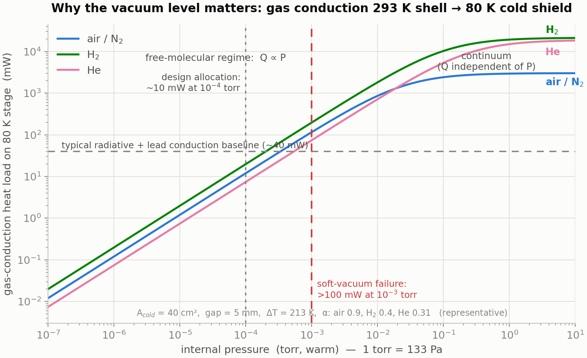
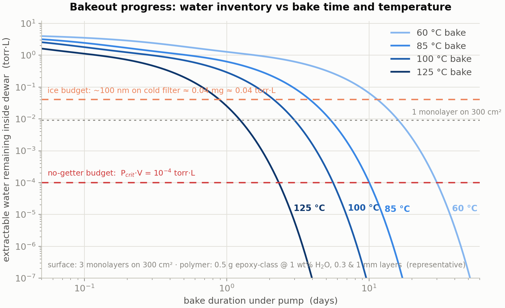
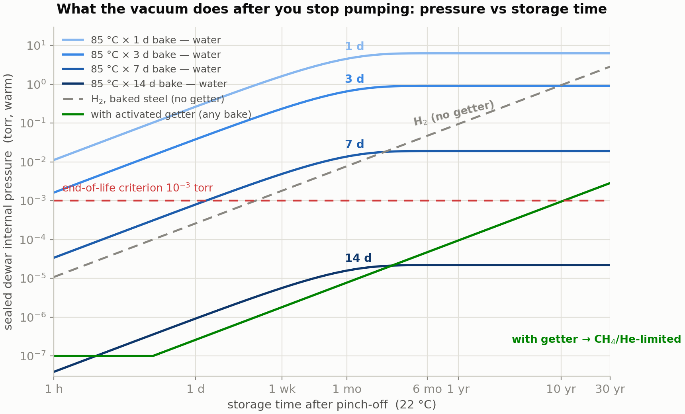
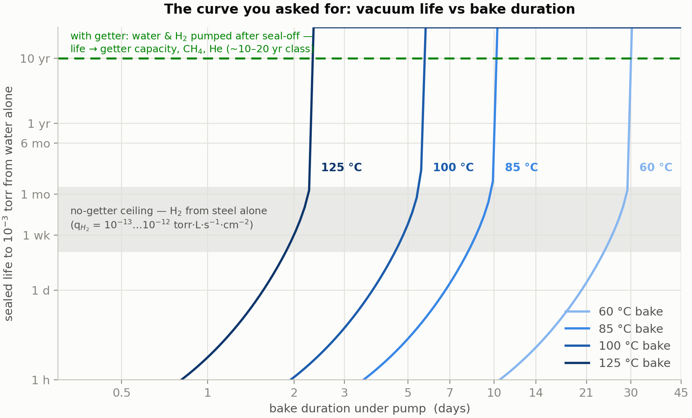

# Dewar Vacuum Bakeout — Required Vacuum, Bake Duration, and Vacuum-Life Curves

*Reference write-up prepared for Jake · July 15, 2026 · Assumes a sealed detector dewar (integrated detector–dewar–cooler assembly class) with the focal-plane array installed, bake temperature capped near 85–100 °C. All hardware-specific numbers are flagged as representative; the physics is general.*

---

## 1. Quick answers

**What vacuum level is required?** For an 80 K sensor in a room-temperature shell, gas conduction becomes a meaningful fraction of the cryocooler's heat-load budget at about 10⁻⁴ torr (1.3×10⁻² pascal) and consumes the entire budget near 10⁻³ torr (0.13 pascal). Practical targets: **≤ 1×10⁻⁴ torr warm as the never-exceed operating level, 10⁻⁵–10⁻⁶ torr at pinch-off** so there is life margin, and ~10⁻³ torr as the end-of-life ("soft dewar") criterion. Above roughly 10⁻² torr a small cooler cannot hold the focal plane at temperature at all.

**One terminology correction first**, because it changes what you calculate: in the millimeter-scale gaps of a dewar the enemy is **free-molecular gas conduction**, not convection. True buoyant convection needs near-atmospheric density and centimeter-scale gaps (Rayleigh number above ~1700); it is dead long before the pressures that matter here. Free-molecular conduction, by contrast, scales *linearly* with pressure and is already eating milliwatts at 10⁻⁴ torr. (For a large pour-filled liquid-nitrogen lab dewar at torr-level pressures, convection language is defensible — but the design threshold is still set by molecular conduction.)

**How long to bake?** The honest answer is that duration is a *measured endpoint, not a clock setting*: you bake until the residual-gas-analyzer water peak (mass 18) has decayed and a warm rate-of-rise test predicts your required life (Section 7 derives the acceptance numbers). That said, the model here — calibrated to published outgassing data — reproduces standard industry practice: **for an assembled dewar limited to ~85 °C, plan on one to two weeks under vacuum; at 100 °C, roughly 4–7 days; a bare shell baked at 150–250 °C needs only 1–3 days.** The long times at low temperature are set by water *diffusing out of epoxies and organics*, not by surface desorption — surface water is gone within hours at 85 °C.

**What happens if we bake too short?** Five distinct failure modes, in the order you'd likely meet them: ice on the coldest optic (transmission loss and image artifacts in-band), cooldown-time growth and loss of cooler margin, premature getter-capacity consumption, warm storage pressure rising past the rate-of-rise spec (field returns), and — in the extreme — inability to reach base temperature. Section 6 quantifies each.

**The requested curve** — dewar vacuum versus bake time — is Figures 2–4: inventory remaining versus bake duration (Fig. 2), sealed pressure versus storage time for a family of bake durations (Fig. 3), and sealed vacuum life versus bake duration (Fig. 4). The central feature is a **knee**: stopping "a little early" does not cost you a little life, it can cost you orders of magnitude, because the remaining water reservoir drains into the sealed volume exponentially in bake time.

---

## 2. Why the vacuum level matters: gas conduction physics

*(Established physics; geometry numbers representative.)*

Which heat-transport regime you are in is set by the Knudsen number Kn = λ/d, the ratio of molecular mean free path to gap size. For air at 295 K, λ ≈ 6.6×10⁻³/P m with P in pascal — about 50 mm at 10⁻³ torr versus a ~5 mm shield-to-shell gap. So below ~10⁻³ torr the dewar is fully free-molecular: molecules ballistically carry energy from the 293 K shell to the 80 K cold shield without colliding with each other, and the heat flux is proportional to pressure:

> **q = α · Λ₀ · P · (T₂ − T₁)**  [W/m²]
>
> Λ₀ = [(γ+1)/(γ−1)] · √( R / (8π·M·T) )

where γ is the specific-heat ratio, M the molar mass, T the temperature at which pressure is measured, R the gas constant, and α the combined thermal accommodation coefficient of the two surfaces. This is the Kennard/Corruccini result (R. J. Corruccini, "Gaseous heat conduction at low pressures and temperatures," *Vacuum* 7–8, 19–29, 1959; textbook treatment in Barron & Nellis, *Cryogenic Heat Transfer*, 2nd ed., CRC 2016, gas-conduction chapter). Evaluated at 295 K:

| Gas | Λ₀ (W·m⁻²·K⁻¹·Pa⁻¹) | Typical α (combined) | q/(P·ΔT) used here |
|---|---|---|---|
| Air / N₂ | 1.18 | ~0.9 | 1.06 |
| H₂ | 4.38 | ~0.4 | 1.75 |
| He | 2.12 | ~0.31 | 0.66 |

Note hydrogen: per unit pressure it carries **~1.7× more heat than air even after its poor accommodation**, and it is exactly the gas a baked steel dewar accumulates. At high pressure the flux saturates at the continuum value q = k_gas·ΔT/d (independent of pressure), bridged smoothly through the transition regime in Figure 1.

For a representative tactical geometry — 40 cm² of cold surface, 5 mm gap, ΔT = 213 K:

| Internal pressure (warm) | Air load | H₂ load | Context |
|---|---|---|---|
| 1×10⁻⁵ torr | 1.2 mW | 2.0 mW | negligible |
| 1×10⁻⁴ torr | 12 mW | 20 mW | ≈ typical design allocation |
| 1×10⁻³ torr | 116 mW | 197 mW | ≈ the entire radiative + lead baseline (~40 mW) several times over; cooldown time visibly stretched |
| 1×10⁻² torr | 0.9 W | 1.8 W | exceeds a small Stirling cooler's lift at 80 K → cannot hold temperature |
| atmospheric | ~3 W (continuum) | — | cannot cool down at all |

One operational subtlety: when the dewar is cold, the 80 K surfaces cryopump water and carbon dioxide essentially perfectly (the vapor pressure of ice at 80 K is far below 10⁻¹⁰ torr), but **not** nitrogen, oxygen, argon, hydrogen, helium, neon, or methane — their vapor pressures at 80 K are above the operating point. So the *operating* gas load is carried by the non-condensables, while the *warm* pressure — what a rate-of-rise test measures — includes the water. Both matter: warm pressure for storage/acceptance, non-condensables for operating heat load, and the cryopumped water for optics contamination (Section 6).

---

## 3. Where the gas comes from

*(Rates from published measurements; inventory arithmetic exact.)*

**Surface water.** Every air-exposed metal surface carries a few monolayers of adsorbed water. Unbaked metals outgas water following the famous inverse-time law, q ≈ 3×10⁻⁹/t(h) mbar·L·s⁻¹·cm⁻² (≈ 2.2×10⁻⁹/t torr units) — the rate depends on pumping time, not on the material being "done" (P. Chiggiato, CERN Accelerator School lecture on outgassing; P. A. Redhead, "Recommended practices for measuring and reporting outgassing data," *J. Vac. Sci. Technol. A* 20, 1667, 2002). The physical origin is a broad distribution of binding energies (~0.75–1.15 eV) with first-order desorption at attempt frequency ν ≈ 10¹³ s⁻¹ (Redhead, *JVST A* 13, 467, 1995; Li & Dylla, *JVST A* 11, 1702, 1993). The model in Section 5 uses exactly this picture and independently reproduces the empirical 1/t coefficient within a factor of ~1.4 — a useful consistency check.

**Polymer water — the reservoir that sets your bake time.** Epoxies, printed-wiring-board laminate, and wire insulation equilibrate at ~0.2–1 % water by mass in ordinary humidity, and release it by *diffusion* (rate falling as 1/√t), far slower than surface desorption (Chiggiato lecture: Vespel ~1 wt %, Viton ~0.21 wt %; water diffusivity in polymers ~10⁻⁹–10⁻⁸ cm²/s at room temperature). The arithmetic is brutal in a small dewar:

- 1 monolayer of water = 10¹⁵ molecules/cm² = 3.1×10⁻⁵ torr·L per cm² → 300 cm² × 3 monolayers ≈ **0.027 torr·L**
- **1 milligram of absorbed water ≈ 1.0 torr·L** at room temperature → 0.5 g of epoxy at 1 wt % holds ≈ 5 torr·L
- The *entire* no-getter gas budget for a 0.1 L dewar to stay below 10⁻³ torr is P·V = **10⁻⁴ torr·L ≈ 0.1 microgram**

**Hydrogen from the steel bulk.** After a modest bake, austenitic stainless steel still emits dissolved hydrogen at ~10⁻¹³–10⁻¹² torr·L·s⁻¹·cm⁻² (CERN data: 3×10⁻¹² mbar·L·s⁻¹·cm⁻² after 150 °C × 24 h; ultra-high-vacuum practice uses 950 °C vacuum firing to get to 10⁻¹⁵, which is not available to an assembled dewar). Integrated over 300 cm² into 0.1 L, hydrogen alone reaches 10⁻³ torr in **4–40 days**. This single number explains why **every sealed infrared detector dewar carries a getter** — no bake you are allowed to perform can meet a multi-year life without one.

**Traces that the getter does not pump:** methane from steel (representative ~10⁻¹⁵ torr·L·s⁻¹·cm⁻², uncertain), argon/neon (negligible), and helium permeation through any glass. A worked estimate for a hypothetical 4 cm², 1-mm borosilicate window at the atmosphere's 5 ppm helium partial pressure gives ~4×10⁻⁵ torr accumulated in 10 years (my estimate from handbook permeation constants — design-dependent; germanium/silicon/sapphire windows with metal seals make it negligible). These non-getterable species are what ultimately set the ~10–20 year life of a well-built, gettered dewar.

---

## 4. Bakeout physics: what temperature and time actually buy you

*(Established kinetics; the design rule is exact within the first-order model.)*

**Surface phase — logarithmic in time, linear in temperature.** First-order desorption at temperature T empties, after time t, all sites with binding energy below an "erosion front"

> **E\* = k_B·T·ln(ν·t)**

Each *decade* of bake time advances the front by only 2.3 k_B·T (≈ 0.07 eV at 85 °C), while temperature multiplies the whole front. That is the quantitative content of "bake hotter, not longer." It also yields a clean design rule: a bake covers a storage requirement when the bake front passes the storage front,

> **T_bake · ln(ν·t_bake) ≥ T_storage · ln(ν·t_life)**

| Requirement | Bake needed (surface-desorption criterion) |
|---|---|
| 10 years at 22 °C storage | 85 °C × **0.6 days** — or 60 °C × 13 days |
| 6 months cumulative at 71 °C (MIL-STD-810-class hot storage) | 85 °C × **30 days** — or 100 °C × 5 days |

Two things jump out. First, surface water is *easy*: even a one-day 85 °C bake out-anneals a decade of room-temperature storage — consistent with ultra-high-vacuum practice, where ≥120 °C for 12 hours removes water from bare metal (CERN). Second, **hot storage is the harder requirement**: if your product spec includes 71 °C storage soaks, a 85 °C bake barely stays ahead of it, which is a real argument for the highest bake temperature the focal plane will tolerate. (This second row is a direct consequence of the desorption algebra — treat it as model inference, and note that a getter changes the conclusion by absorbing what hot storage re-mobilizes.)

**Polymer phase — this is why assembled-dewar bakes take weeks.** Water leaves a polymer layer of half-thickness L with Fickian time constant τ₁ = 4L²/(π²·D), and D is Arrhenius with ~0.45 eV activation:

| Temperature | D (cm²/s) | τ₁, 0.3 mm layer | τ₁, 1 mm layer |
|---|---|---|---|
| 22 °C | 2.0×10⁻⁹ | 2.1 d | 23 d |
| 60 °C | 1.5×10⁻⁸ | 0.28 d | 3.1 d |
| 85 °C | 4.5×10⁻⁸ | 0.09 d | 1.0 d |
| 100 °C | 8.2×10⁻⁸ | 0.05 d | 0.6 d |
| 125 °C | 2.0×10⁻⁷ | 0.02 d | 0.24 d |

You need several time constants to drain a reservoir that starts thousands of times over budget, and buried adhesive joints that can only dry from an edge behave *much* thicker than their bond line. Add **conductance starvation** — everything must leave through the pinch-off tube, whose molecular-flow conductance for water is only ~0.2 L/s for a 4 mm × 50 mm tube — plus readsorption on interior walls, and the practical answer lands where industry practice sits: **one to three weeks at 70–100 °C for an assembled dewar.**

**Why not just bake hotter?** Assembly temperature ceilings, in roughly the order they bind: indium bump bonds (indium melts at 156.6 °C; hybrids are kept well below), epoxy glass-transition and decomposition, cold-filter coating stacks, and cooler magnets if the cooler is attached (neodymium magnets derate above ~80–100 °C). Bare dewar shells, before detector integration, are baked at 150–250 °C precisely because none of those constraints apply yet. The getter is the exception — it *needs* 350–450 °C locally for activation and gets it from its own integral heater under vacuum just before pinch-off (SAES data; Sandia report SAND2010 on St 707 activation: ~400 °C × 45 min).

Figure 2 shows the full inventory model (surface + polymer): the curves fall off a cliff once the polymer time constant is passed, and the horizontal lines mark the two budgets that matter — the no-getter pressure budget (10⁻⁴ torr·L) and the cold-optics ice budget (~0.04 torr·L, Section 6).

---

## 5. The sealed-life model and the curves you asked for

*(Illustrative model with stated parameters — calibrate to your hardware's rate-of-rise data before using for program decisions.)*

**Model.** Surface water: 3 monolayers on 300 cm², binding energies uniform on 0.75–1.15 eV, ν = 10¹³ s⁻¹; first-order desorption during bake, remainder desorbs into the sealed volume at storage temperature. Polymer water: 0.5 g organics at 1 wt % in two populations (60 % in 0.3 mm layers, 40 % in 1 mm), Fickian slab kinetics with the two-stage bake/storage solution done exactly (the eigenmode argument is additive: D_bake·t_bake + D_store·t_store). Fixed gases: hydrogen at 10⁻¹² torr·L·s⁻¹·cm⁻² (band 10⁻¹³–10⁻¹²), methane at 10⁻¹⁵. Free volume 0.1 L; failure criterion 10⁻³ torr warm; storage at 22 °C. Getter modeled as a fast pump for water/hydrogen/carbon-monoxide-class gases with finite capacity, blind to methane and noble gases.

**Reading Figure 3.** Without a getter, a 1- or 3-day 85 °C bake blows through 10⁻³ torr within *hours to a day* of pinch-off — the leftover polymer water simply re-equilibrates into the volume, saturating in the 0.1–6 torr range. A 7-day bake crosses the line in about a day; a 14-day bake leaves so little water that its plateau sits at 2×10⁻⁵ torr — but hydrogen (gray dashed) then walks the ungettered dewar over the line in a few days anyway. The green line is the gettered dewar: water and hydrogen are absorbed after seal-off, and pressure only climbs on the methane/helium accumulation slope, crossing end-of-life around the 10-year mark. **The getter is not optional equipment; it is the difference between days and a decade.**

**Reading Figure 4 — the direct answer to "what if we stop a little early?"** The sealed life from water alone versus bake duration is nearly vertical around a knee: at 85 °C the knee sits near 10 days (with these parameters). Stop at 10 days instead of 14 and water-only life drops from effectively-unbounded to ~2 months; stop at 7 days and it is ~1 day. Every temperature has the same shape shifted left or right — 125 °C has its knee near 2.5 days, 60 °C near a month. Two consequences worth internalizing: **(1)** bake margin is cheap insurance precisely because the penalty function is a cliff, not a slope; **(2)** the knee's position scales with the *slowest diffusive reservoir* in your dewar, which is why organics minimization (and pre-baking piece parts before assembly) moves the whole curve left.

**Where the getter changes the story.** With a healthy activated getter, stopping early does *not* show up as warm pressure — the getter eats the leftover water. The penalties move: (a) getter capacity is consumed — the water sorption capacity of a Zr-V-Fe getter is only of order 1–10 torr·L per gram at room temperature for surface-limited species (St 707 estimate ≈ 2.4 torr·L/g; hydrogen capacity is far larger, ~170 torr·L/g at saturation — Sandia SAND2010; University of Chicago PSEC getter notes), so a 1.5 torr·L water leftover from a 6-hour bake can consume a large fraction of a half-gram pill; and (b) the ice budget on the cold optics, next section, which the getter can only partially defend because it competes with the coldest surface for the same molecules.

**Model limitations, stated plainly:** the knees are model-sharp; real hardware has a spread of layer thicknesses, materials, and re-adsorption paths that smooth them. The parameters (organics mass, layer thicknesses, areas, volumes, rates) are representative, not yours. Helium is excluded except as an estimate; hydrogen decay over years is conservatively ignored. Use the *shape* and the *scalings*; anchor the absolute numbers with a rate-of-rise measurement on your own article.

---

## 6. Failure modes of an under-baked dewar

**Ice on the coldest optic.** During operation, whatever water is still outgassing cryopumps onto the coldest surfaces — the cold filter and focal plane among them. Water ice has strong infrared absorption bands at **3.16 µm (O–H stretch), 4.6 µm, 6.1 µm, and a broad lattice feature near 13 µm**; at the 3.1 µm peak only ~0.3 µm of ice absorbs strongly, and ~1 µm cuts the in-band signal to ~10 % in the 3.0–3.1 µm band (Air Force Research Laboratory report, "The Infrared Spectral Signature of Water Ice in the Vacuum Cryogenic AEDC Chamber," DTIC ADA443824). The 3.16 µm band sits right at the mid-wave infrared band edge, and the 13 µm wing intrudes on long-wave systems. Ice also raises the emissivity of low-emissivity cold shields (raising radiative load) and shows up as growing blemishes and non-uniformity-correction drift over an operating session; it sublimes on warm-up near ~150 K and re-deposits somewhere else next cooldown. Worked example from the model: a 3-day 85 °C bake leaves ≈ 90 µg of water; if over the fleet's early life half of it finds a 4 cm² cold filter, that is ≈ **110 nm of ice — already at the budget** where mid-wave transmission loss is measurable.

**Cooldown time growth and margin loss.** At 10⁻³ torr the gas load (~120 mW air-equivalent, more if hydrogen-rich) is several times the parasitic baseline. Cooldown time — the most-watched health metric in acceptance and the one that trends in returned units — stretches first; steady-state compressor input power rises; in hot-ambient corners the cooler loses the ability to hold setpoint. Near 10⁻² torr, thermal runaway: the cooler cannot reach base temperature.

**Getter capacity consumption**, as above — the getter silently absorbs the bake you skipped, and the dewar's 10-year getter margin quietly becomes 3 years. Nothing looks wrong at acceptance.

**Warm rate-of-rise failures and storage regression.** An under-baked dewar can pass a short acceptance if tested promptly, then fail rate-of-rise or cooldown-time screens months later — the polymer reservoir keeps delivering at its 23-day room-temperature time constant, and 71 °C storage soaks re-mobilize surface sites deeper than a marginal bake front (Section 4 rule). This is the classic "it was fine at sell-off" field-return signature.

---

## 7. Recommended procedure and acceptance criteria

*(Framework with representative numbers — set actual limits from your program's life requirement.)*

1. **Pre-dry piece parts.** Vacuum-bake or dry-nitrogen-bake organics-bearing subassemblies before final assembly; keep the assembled dewar's organics inventory minimal and use low-outgassing materials (ASTM E595-class: total mass loss < 1 %, collected volatile condensable material < 0.1 %).
2. **Evacuate before heating.** Pump to < 10⁻⁵ torr at room temperature first; then ramp slowly (~0.5–1 °C/min) with a pressure interlock (e.g., hold ramp if > 5×10⁻⁴ torr) so you never operate the hybrid in a soft-vacuum, high-conduction condition.
3. **Bake at the maximum temperature the assembly allows** — every 15 °C roughly halves the required time (0.45 eV diffusion activation). Monitor the residual gas analyzer: the endpoint signature is the mass-18 (water) peak decaying decade-over-decade and the total rate-of-rise approaching spec, not a calendar date. Remember the gauge at the pump under-reads the interior by the pinch-off-tube conductance ratio.
4. **Endpoint by measured rate-of-rise (ROR).** Valve off and watch warm pressure over 12–48 h. The allowable average outgassing rate follows directly from the budget: with getter capacity margin C and required life t_life, Q̄ ≤ C/t_life — e.g., 2 torr·L of reserved water/hydrogen capacity over 10 years allows 6.3×10⁻⁹ torr·L/s, i.e., **≈ 5×10⁻³ torr/day warm ROR in a 0.1 L volume**; tighten by your ice-budget allocation. (Without a getter the same algebra demands 3×10⁻¹³ torr·L/s — three decades below achievable — which is the formal proof that the getter is mandatory.)
5. **Activate the getter under full pumping** (Zr-V-Fe class: ~350–450 °C locally via integral heater; activation liberates a gas burst — do it while the pump can take it), let the system recover into the 10⁻⁶–10⁻⁷ torr range, then **pinch off** (cold-weld crimp) while cold-trap-clean.
6. **Verify and trend.** First-cooldown time and steady-state input power against ATP limits; repeat cooldown-time checks through environmental stress screening and periodically in storage — a creeping cooldown time is the vacuum telling you its history. A re-pump/re-bake port strategy (or re-activation-capable getter) is worth its mass in fleets.

---

## 8. Assumptions table (model parameters)

| Parameter | Value | Basis |
|---|---|---|
| Internal wetted metal area | 300 cm² | representative tactical IDCA |
| Free volume | 0.1 L | representative |
| Cold surface / gap / ΔT | 40 cm² / 5 mm / 213 K | representative |
| Surface water | 3 monolayers, E = 0.75–1.15 eV, ν = 10¹³ s⁻¹ | Redhead-type model; reproduces empirical 1/t law within ×1.4 |
| Organics | 0.5 g at 1 wt % H₂O; layers 0.3 mm (60 %) and 1 mm (40 %) | representative; dominant uncertainty |
| Water diffusivity in epoxy | 2×10⁻⁹ cm²/s at 22 °C, E_a = 0.45 eV | literature-class values |
| H₂ outgassing (baked steel) | 10⁻¹² (10⁻¹³–10⁻¹²) torr·L·s⁻¹·cm⁻² | CERN data after 150 °C × 24 h |
| CH₄ outgassing | 10⁻¹⁵ torr·L·s⁻¹·cm⁻² | rough; sets gettered-life ceiling |
| End-of-life pressure | 10⁻³ torr warm | gas-conduction budget, Sec. 2 |
| Getter | fast pump for H₂O/H₂/CO; capacity ~2 torr·L reserved; blind to CH₄/noble gases | SAES St 707-class data |

---

## 9. Sources

**Fetched and used directly:**

- P. Chiggiato (CERN), *Outgassing — CERN Accelerator School lecture notes* (2017): water 1/t law and coefficient, bake recommendations, H₂ rates for baked steel and copper, polymer water contents and 1/√t diffusion kinetics, vacuum-firing data. https://cas.web.cern.ch/sites/default/files/lectures/glumslov-2017/chiggiato.pdf
- Air Force Research Laboratory / AEDC, *The Infrared Spectral Signature of Water Ice in the Vacuum Cryogenic Chamber* (DTIC ADA443824): ice band positions 3.16/4.6/6.1/13 µm, thickness-vs-absorption, ~150 K sublimation. https://apps.dtic.mil/sti/pdfs/ADA443824.pdf
- Sandia National Laboratories, *Hydrogen Capacity and Absorption Rate of the SAES St 707 Getter* (2010): H₂ capacity ~225 std cm³/g (~170 torr·L/g), activation ~400 °C × 45 min. https://psec.uchicago.edu/getters/sandia_ST707_getter_data_105402.pdf
- University of Chicago PSEC getter notes: St 707 water capacity estimate (~7.9×10¹⁹ molecules/g ≈ 2.4 torr·L/g), pumping-speed ratios, activation fractions vs temperature. https://psec.uchicago.edu/getters/H2O_monolayer_v2.pdf
- DSPE thermomechanics knowledge base, free-molecular heat transfer formula and validity criterion. https://www.dspe.nl/knowledge/thermomechanics/chapter-2-in-depth/conduction-in-gasses/regime-1-free-molecular-heat-transfer/

**Standard references (cited from the literature; not re-verified online in this session):**

- R. J. Corruccini, "Gaseous heat conduction at low pressures and temperatures," *Vacuum* 7–8, 19–29 (1959).
- T. M. Barron & G. F. Nellis, *Cryogenic Heat Transfer*, 2nd ed., CRC Press (2016) — gas-conduction chapter.
- P. A. Redhead, "Recommended practices for measuring and reporting outgassing data," *J. Vac. Sci. Technol. A* 20, 1667 (2002); and "Modeling the pump-down of a reversibly adsorbed phase," *J. Vac. Sci. Technol. A* 13, 467 (1995).
- M. Li & H. F. Dylla, "Model for the outgassing of water from metal surfaces," *J. Vac. Sci. Technol. A* 11, 1702 (1993).
- J. F. O'Hanlon, *A User's Guide to Vacuum Technology*, 3rd ed., Wiley (2003) — outgassing tables, conductance formulas.
- ASTM E595, *Standard Test Method for Total Mass Loss and Collected Volatile Condensable Materials from Outgassing in a Vacuum Environment*.

**Industry context (titles located this session):** SCD, "Ruggedizing infrared Integrated Dewar-Detector Assemblies for harsh environmental conditions," SPIE DSS 2014; Cryocooler Conference and SPIE proceedings on integrated-detector-dewar-cooler reliability and failure analysis.

---

*Model and figure source code: `model.py`, `figures.py` (same folder as this document). Figures regenerate from the stated parameters; edit the PARAMS block to match your hardware.*
