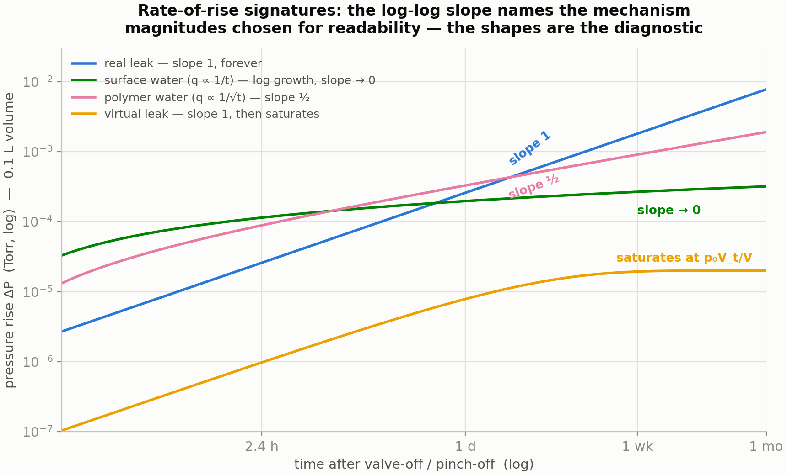

# Leak Diagnosis Process — Species Physics and a Decision Tree

*July 31, 2026 · Companion to the pump-down simulator and `dewar_vacuum_model`. All worked numbers use the project's representative hardware (0.1 L sealed dewar, 10⁻³ Torr end-of-life; pumped-system examples use the nXDS10iC + nEXT85 station and the 10 mm × 10 cm bottleneck, S_eff ≈ 1.05 L/s at base).*

---

## 1. Why molecular mass (AMU) matters — the species matrix

Every transport and pumping process in the system is mass-selective, and the *pattern* of that selectivity is the diagnostic toolkit. At 295 K:

| Gas | M (amu) | C_molecular / C(N₂) — ∝ √(28/M) | Viscosity (µPa·s) | C_viscous / C(N₂) — ∝ 1/η | Free-molecular heat factor vs N₂ | 80 K cryopumped? | Gettered? |
|---|---|---|---|---|---|---|---|
| H₂ | 2 | **3.73** | 8.9 | 2.00 | 3.65 | no | yes |
| He | 4 | **2.65** | 19.8 | 0.90 | 1.76 | no | **no** |
| H₂O | 18 | 1.25 | 9.9 | 1.80 | 1.47 | **yes** | yes |
| N₂ | 28 | 1.00 | 17.8 | 1.00 | 1.00 | no | yes (slow) |
| O₂ | 32 | 0.94 | 20.6 | 0.86 | 0.94 | no | yes |
| Ar | 40 | 0.84 | 22.6 | 0.79 | 0.56 | no | **no** |
| CO₂ | 44 | 0.80 | 14.9 | 1.19 | 1.02 | yes | yes |

Four readings of this table:

**Bottlenecks (molecular regime).** Conductance is ∝ mean thermal speed ∝ √(T/M) — nothing else about the molecule matters once flow is molecular. Hydrogen clears the same tube 3.7× faster than nitrogen; CO₂ 20 % slower; the full H₂→CO₂ span is ×4.7. This is why the simulator scales the water species' molecular conductance by √(29/18) = 1.27.

**Bottlenecks (viscous regime).** Mass drops out; *viscosity* rules — and the ordering scrambles. Helium is actually slightly *worse* than nitrogen viscously (η_He > η_N₂, a monatomic-gas quirk), while H₂ and H₂O flow ~2× and ~1.8× better. Practical consequence: species distinctions barely matter above ~1 Torr and matter enormously below 10⁻³ Torr.

**Pumps invert the trend.** A turbo's blades must outrun the molecule's thermal speed, so the *fast* gases are the *hard* gases: the nEXT85's speed only sags mildly for He and H₂ (~80 and ~60 L/s vs 84 for N₂) but its compression ratio collapses from >10¹¹ (N₂) to ~10⁷ (He) to ~2×10⁵ (H₂) — which is why the residual gas at a turbo's ultimate pressure is hydrogen, and why He backstreaming limits sensitivity in leak detectors. The 80 K cryopump inside an operating dewar is the most selective pump of all: perfect for H₂O/CO₂, zero for everything lighter than CO₂ except nothing. And the getter pumps everything chemically active but is blind to He, Ar, CH₄.

**Do we need to track species separately?** For *pump-down time*: no — it's air-dominated, and the ±25 % water-conductance correction is already in the model. For *diagnosis*: absolutely — every test below works precisely because mass separates the species. Helium is the probe gas of choice for exactly four properties: light (fast conductance, fast response), rare (5.2 ppm atmospheric background), inert, and invisible to getters and cryosurfaces (a He signal cannot be pumped away or confused with outgassing).

**Leak-rate unit conversions** (same channel, molecular flow): Q_air = Q_He·√(4/29) = **0.372 × Q_He**; Q_He = 2.69 × Q_air. In viscous (gross) leaks the ratio is η-based and ≈ 1.1 — near unity. Always state which convention a spec uses.

---

## 2. The decision tree

**Symptom → Step 1: does the base pressure floor *fall* or *hold*?** (pumped system, days timescale — or the simulator's leak toggle). A floor that decays, however slowly, is outgassing. A floor that holds constant indefinitely is a leak or permeation: P_floor = Q/S_eff. Worked: 10⁻⁶ Torr·L/s of air through our bottleneck station floors at 9.5×10⁻⁷ Torr — measured and predicted agree in the simulator to three digits.

**Step 2: valve off (or pinch off) and read the rate-of-rise *shape*, not just its size.** On a log-log plot of ΔP vs time the slope names the mechanism:

| log-log slope of ΔP(t) | Mechanism | Check |
|---|---|---|
| 1, forever | **real leak or permeation** | ΔP(2t)/ΔP(t) = 2.0 exactly; composition is air-like |
| ½ | polymer/adhesive water (diffusion) | rises with recent thermal history; m/z 18 |
| → 0 (logarithmic) | surface water desorption | shrinks decade-per-decade of prior pumping time |
| 1 early, then hard saturation | virtual leak (trapped volume) | total ΔP·V ≈ p₀V_t — a *finite* inventory; τ = V_t/C of weeks |

The two-point test is the cheapest discriminator in vacuum practice: measure dP/dt at t and at 3t after valve-off. Ratio 1.0 → leak. Ratio ~1/3 → surface water. Ratio ~0.58 (1/√3) → diffusion.

**Step 3: composition (residual gas analyzer).** Air has a fingerprint no outgassing can fake:

| Signature | Reading |
|---|---|
| m/z 28 : 32 ≈ 4 : 1, with m/z 40 (Ar) at ~1 % of 28, m/z 14 present | **air leak** — the O₂ and Ar are the tell; outgassing CO also sits at 28 but brings no 32 and no 40 |
| m/z 18 dominant with 17 at ~23 % of 18, plus 2 and 44 | outgassing (water, hydrogen, CO₂) — the healthy unbaked spectrum |
| m/z 28 large, 32 absent | CO from surfaces/hot filaments, not a leak |
| m/z 4 above background | helium — see Step 4; in a *sealed gettered* dewar any He/Ar growth is damning, since nothing inside makes or pumps them |

**Step 4: helium testing, matched to the article.** For a *pumped* article: spray-probe with a mass-spectrometer leak detector or the RGA on m/z 4, working top-down and upwind, with response time τ = V/S_He per event (≈ 35 s for our 100 L chamber — wait it out or you mislocate the leak). Sensitivity ~10⁻⁹–10⁻¹⁰ atm·cc/s routinely. For a *sealed* article (pinch-off dewar): bombing (pressurize in He, then detect efflux, MIL-STD-883 TM1014-style) for gross-to-fine screening, or the highest-sensitivity option, **accumulation**: park the article in a small purged enclosure and let helium (or, for a sealed dewar's interior, argon from an air leak) integrate for hours-to-weeks; Q = ΔP·V_enclosure/t. Accumulation methods reach 10⁻¹³ atm·cc/s and, in laboratory practice with RGA sampling, ~10⁻¹⁸ mbar·L/s for noble gases (Chiggiato) — background control and purge quality, not the instrument, set the floor.

**Step 5: judge against the *requirement*, not the test floor.** From the project's budget math: a 10-year ungettered dewar allows 4×10⁻¹³ atm·cc/s total — below any spray test; a gettered dewar's argon-accumulation limit allows 4.5×10⁻¹¹ atm·cc/s of air — still below routine spray sensitivity. So for sealed dewars the spray/bomb test is a **gross-defect screen**; life-grade hermeticity is demonstrated by process control plus the accumulation-class tests and, in the fleet, by trending warm rate-of-rise and cooldown time across storage intervals — a linear-in-time trend line is a leak; a decelerating one is outgassing.

---

## 3. The process, condensed

1. Trend the pumped base pressure (or sealed ROR) — **falling = outgassing, constant = leak**.
2. Valve off; log-log the rise; apply the two-point slope test (1 vs ⅓ vs 1/√3; saturation = virtual leak).
3. RGA: look for the O₂+Ar air fingerprint; He/Ar growth in a sealed gettered volume is a leak, full stop.
4. Localize with He spray (mind τ = V/S); quantify sealed articles by accumulation; convert He↔air by ×0.372 (molecular).
5. Compare to the budget-derived allowable, and record the result as a *rate*, stating the gas and conversion.

*Sources: species table computed from kinetic theory (√(28/M)) and standard 295 K viscosities; turbo per-gas speeds and compressions from the Edwards nEXT brochure; accumulation sensitivity from Chiggiato, CERN Yellow Rep. arXiv:2006.07124; He↔air conversions are exact molecular-flow kinematics; MIL-STD-883 TM1014 named for the bombing method's lineage. Budget allowables derived in `vacuum_degradation_sources.md` and `dewar_vacuum_model/REVIEW.md`.*
