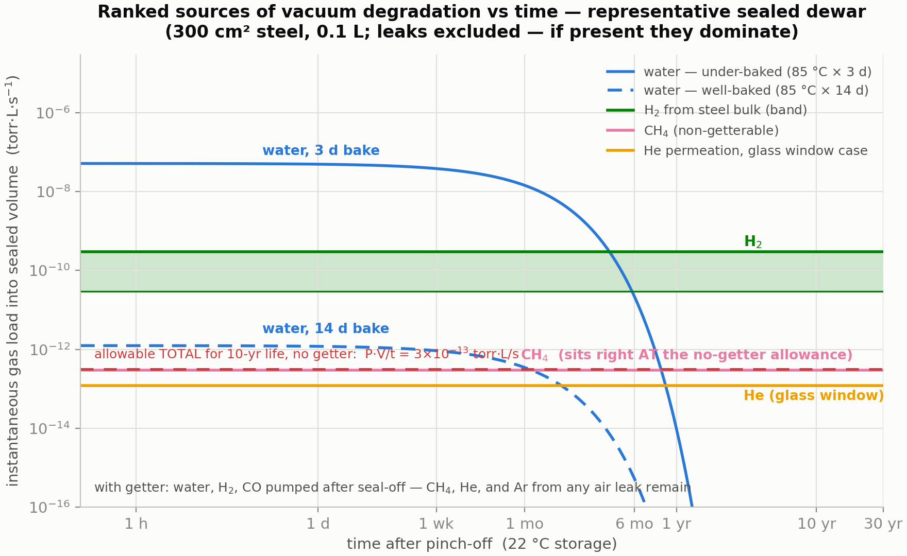

# Sources of Vacuum Degradation in Sealed Dewars — A Ranked Review with Calculation Methods

*Prepared for Jake · July 16, 2026 · Literature-based synthesis, with all quantitative examples computed for the representative sealed detector dewar used throughout this project (300 cm² wetted steel, 0.1 L free volume, end-of-life criterion 10⁻³ torr warm, 10-year life). Source papers are tiered by how deeply they could be accessed this session — see Section 4.*

---

## 1. The ranking

The vacuum literature converges on a short list of gas-source mechanisms: **desorption of adsorbed gas (dominated by water), diffusion-fed outgassing from polymer bulk, hydrogen outgassing from metal bulk, permeation from the atmosphere, real leaks, virtual leaks, and vaporization** — plus, specific to sealed cryogenic hardware, **getter exhaustion and the return of cryopumped inventory on warm-up**, which are not sources but multipliers. Grinham & Chew's review states the headline plainly: for a system at high vacuum or better, *outgassing is ~90 % of the total gas load*, and the composition shifts with pressure regime — roughly 75–95 % water vapor near 10⁻³ mbar, water and carbon monoxide through the 10⁻⁶–10⁻⁹ mbar range, and hydrogen limiting below ~10⁻¹¹ mbar. Chiggiato's CERN Yellow Report chapter adds the material hierarchy: after cleaning, water dominates metal outgassing; after bakeout, hydrogen from the metal bulk takes over; and polymers outgas roughly **500× more than metals** under equivalent conditions because they hold water in bulk solution at up to percent level.

Translating that general hierarchy to a *sealed, gettered, all-metal infrared detector dewar*, ranked by impact on the vacuum-life budget:

| Rank | Mechanism | Time signature | Representative magnitude (this dewar) | When it dominates | Getter helps? |
|---|---|---|---|---|---|
| 1 | Water from polymers/adhesives (bulk diffusion) | ~1/√t, then exponential decay; reservoir = mg-class | 4×10⁻⁸ torr·L/s at 1 wk after a short (3 d, 85 °C) bake; ~10⁻¹² after 14 d bake | Under-baked hardware, first weeks–months; sets required bake time | Yes — but consumes capacity and feeds cold-optics ice |
| 2 | Water from metal surfaces (desorption) | 1/t law | 2×10⁻⁹ torr·L/s·cm⁻² at 1 h unbaked; gone within hours at 85 °C | Unbaked/short-pumped hardware only | Yes |
| 3 | Hydrogen from metal bulk | ~constant over years (slow √t decay) | (0.3–3)×10⁻¹⁰ torr·L/s for 300 cm² baked steel → 10⁻³ torr in 4–40 days ungettered | Every well-baked, **ungettered** metal dewar — the reason getters are universal | Yes — H₂ is the getter's best gas |
| 4 | Real leaks (welds, brazes, feedthroughs, pinch-off) | constant | binary: absent or dominant. Budget allowance is 4×10⁻¹³ atm·cc/s (no getter) — *below He-test sensitivity* | Whenever present; screened by process control, not provable by standard leak test | Partially — pumps N₂/O₂ but not He/Ar of an air leak |
| 5 | Permeation | constant after lag time | He through a hypothetical 4 cm², 1 mm borosilicate window ≈ 1.2×10⁻¹³ torr·L/s (~4×10⁻⁵ torr per decade) — negligible for Ge/Si/sapphire on metal seals | Glass windows/frits, any elastomer anywhere (elastomer seals are immediately fatal in sealed service) | No — He is not gettered |
| 6 | Non-getterable traces (CH₄, Ar, Ne) | constant | CH₄ at ~10⁻¹⁵ torr·L/s·cm⁻² ≈ 3×10⁻¹³ torr·L/s — **almost exactly the entire 10-year no-getter allowance** | Sets the life ceiling of a *well-built gettered* dewar | No — by definition |
| 7 | Virtual leaks (trapped volumes) | exponential, τ = V_t/C | 1 mm³ of trapped air = 7.6×10⁻⁴ torr·L = 7.6× the whole no-getter budget, released over weeks–months | Poorly vented fasteners, double welds, blind holes | Mostly (air minus Ar) |
| 8 | Vaporization / organic volatiles | material-dependent | negligible with ASTM E595-compliant materials | Contamination (condensables on cold optics) more than pressure | Partially |

Three context notes, because the ranking is *conditional*. First, in an **elastomer-sealed laboratory system** permeation through the O-rings jumps to the top — this is why sealed dewars are all-metal (welded, brazed, cold-weld pinch-off). Second, in **accelerator ultra-high-vacuum** practice the ranking is water → hydrogen because polymers are banned outright; a detector dewar cannot ban polymers, which is exactly why adhesive inventory management (the volume/area knobs in our Python model) matters so much. Third, the dewar-specific reliability literature (Section 4, Tier C) consistently identifies **vacuum degradation as a leading life-limiter of integrated detector–dewar–cooler assemblies**, observed operationally as cooldown-time growth and hold-time loss — the failure-analysis and accelerated-test papers treat outgassing plus micro-leakage as the governing mechanisms and fit Arrhenius-type acceleration to predict storage life.

---

## 2. Calculating each contribution

The universal accounting frame: a sealed volume V with end-of-life pressure P_crit tolerates a **total gas budget P_crit·V** (here 10⁻⁴ torr·L ≈ 0.1 µg water-equivalent). A mechanism matters exactly in proportion to its integrated release ∫Q(t)·dt against that budget (or against getter capacity for getterable species). All equations below are the standard forms from the Tier A/B reviews.

### 2.1 Surface water desorption

**Physics.** First-order desorption from a broad distribution of binding energies (~0.75–1.15 eV on technical metal oxides; Chiggiato quotes 0.9–1.06 eV depending on pumping duration, and Jousten 19–23 kcal/mol) with attempt frequency ν ≈ 10¹³ s⁻¹. The superposition over the energy distribution produces the empirical inverse-time law:

> q_H₂O(t) ≈ q₁·(t₁/t)ⁿ, n ≈ 0.9–1.2, with q₁ ≈ 2–3×10⁻⁹ torr·L·s⁻¹·cm⁻² at 1 h for unbaked metal

**Calculation.** For pump-down and bake studies, integrate the Redhead multi-energy model (our `dewar_model.outgassing.SurfaceWater` does exactly this and reproduces the 1/t coefficient within ×1.5). The bake design rule falls out analytically: sites below the erosion front E\* = k_B·T·ln(ν·t) are emptied, so a bake covers a storage life when T_bake·ln(ν·t_bake) ≥ T_store·ln(ν·t_life).

**Measurement.** Throughput (orifice) method for rates; temperature-programmed desorption for the energy distribution. Chief pitfall per Grinham & Chew: **readsorption inflates apparent water rates by ~3×** on typical geometries, and ionization gauges themselves pump.

### 2.2 Water from polymers and adhesives (usually rank 1 in an assembled dewar)

**Physics.** Water dissolves in the polymer bulk (0.2–1+ wt % at ordinary humidity: Viton ~0.21 %, Vespel/Kapton ~1 % per Chiggiato) and leaves by Fickian diffusion. For a layer of effective thickness L = volume/exposed-area:

> Early time (semi-infinite): q(t) = c₀·√(D/π·t) per unit exposed area — the t^(−1/2) signature
>
> Late time (slab): q(t) ∝ exp(−π²·D·t/4L²), time constant τ₁ = 4L²/(π²·D)

with D(T) = D₀·exp(−E_a/k_B·T); representative water diffusivities ~10⁻⁹–10⁻⁸ cm²/s at room temperature (PEEK ~4×10⁻⁹, Kapton ~1.7×10⁻⁹ per Chiggiato), E_a ≈ 0.4–0.5 eV.

**Calculation.** Inventory = Σ volumeᵢ·densityᵢ·wt%ᵢ (1 mg ≈ 1.0 torr·L); deplete each reservoir through bake and storage with the two-stage Fickian solution (exact, because the eigenmode decay argument is additive — `dewar_model.outgassing.Adhesive`). The controlling parameter is L = V/A_exposed, which is why a buried bond line venting at its perimeter behaves far worse than its bond-line thickness suggests.

**Measurement.** ASTM E595 (total mass loss / collected volatile condensable material) for screening; gravimetric sorption (ASTM D570, dynamic vapor sorption) for c₀ and D; in-situ: residual-gas-analyzer mass-18 trend during bake, warm rate-of-rise after.

### 2.3 Hydrogen from the metal bulk

**Physics.** Hydrogen dissolved during melting/processing diffuses to the surface, recombines, and desorbs. Two limits (Jousten; Chiggiato): **diffusion-limited** — early q ∝ t^(−1/2), late exponential in Fourier number D·t/L² — and **recombination-limited** (second-order in surface concentration) for well-degassed material. Practical engineering values: ~3×10⁻¹² mbar·L·s⁻¹·cm⁻² after 150 °C × 24 h bake; each repeat bake cycle buys only ~×1.6–1.8; vacuum firing at 950 °C reaches 10⁻¹⁵ (unavailable to assembled hardware — do it to piece parts). NIST work on medium-temperature (400–450 °C) treatments of piece-part steel sits usefully between.

**Calculation.** For life budgets, a constant q_H₂ ∈ [10⁻¹³, 3×10⁻¹²] torr·L·s⁻¹·cm⁻² times wetted area is honest and slightly conservative. This term alone kills any ungettered metal dewar in days-to-weeks (Figure 1) — treat it as the formal proof of getter necessity, and size getter capacity against its 10-year integral (~0.1–1 torr·L here; trivial for a Zr-V-Fe getter whose H₂ capacity is bulk).

**Measurement.** Accumulation method at modest temperature, or throughput at elevated temperature scaled back by the ~0.5 eV diffusion activation energy.

### 2.4 Permeation

**Physics.** Steady-state flux through a wall of thickness d and area A (Perkins' review is the classic compilation):

> Molecular transport (He/H₂ through glass; all gases through polymers): Q = K_perm·A·Δp/d — linear in pressure
>
> Dissociative transport (H₂ through metals): Q = Φ·A·(√p₁ − √p₂)/d — Sieverts square-root law
>
> Transient: time-lag method, t_lag = d²/6D, which is also how D is measured

**Calculation.** Only three cases matter for a dewar: helium (atmospheric partial pressure 4×10⁻³ torr) through any glass — the worked borosilicate-window number above comes from handbook permeation constants (Norton; Altemose) and is a *my-estimate* flag, since real windows are germanium/silicon/sapphire on metal seals where permeation is negligible; hydrogen through hot steel (irrelevant at storage temperatures); and **anything through elastomers** — an O-ring passes ~10⁻⁸–10⁻⁷ torr·L/s of air per centimeter of seal, thousands of times the budget, which is why sealed dewars contain none.

**Measurement.** Two-chamber permeation cell with time-lag analysis; for finished hardware, helium accumulation testing (below).

### 2.5 Real leaks — and why you cannot simply "leak test to the requirement"

**Physics.** A molecular-flow leak passes Q_gas = C_leak·Δp with conductance ∝ 1/√M, so a helium-measured leak converts to air as Q_air ≈ Q_He·√(4/29) ≈ 0.37·Q_He (same channel, molecular flow).

**Calculation — the budget arithmetic that surprises people.** With no getter, the allowable *total* constant load for 10 years is P_crit·V/t = 3.2×10⁻¹³ torr·L/s = **4×10⁻¹³ atm·cc/s** — one to three decades below the practical sensitivity of a standard helium fine-leak test (~10⁻⁹–10⁻¹⁰ atm·cc/s). With a getter, the getterable majority of an air leak (N₂, O₂, CO₂, H₂O) charges against capacity — 2 torr·L over 10 years allows 8×10⁻⁹ atm·cc/s, which *is* testable — but air is 0.93 % argon and 5 ppm helium, neither gettered, and the argon-accumulation limit works out to **3.4×10⁻¹¹ torr·L/s of air** — again below routine test sensitivity. The honest engineering conclusions, which is how the industry actually operates: hermeticity is assured by **process control** (weld/braze qualification, pinch-off qualification) plus getter margin; the leak test is a *gross-defect screen*, not a life demonstration; and if you need a measured life-grade leak number, use **helium accumulation**: seal the article in a known volume, wait days-to-weeks, and measure accumulated helium with a mass-spectrometer or residual-gas-analyzer sample — Chiggiato notes accumulation methods reach ~10⁻¹⁸ mbar·L/s sensitivity for noble gases. The complementary field method is trending warm rate-of-rise and cooldown time across storage intervals: a linear-in-time pressure signature distinguishes a leak or permeation from the decaying signatures of outgassing.

### 2.6 Virtual leaks

**Physics.** A trapped volume V_t at initial pressure p₀ venting through conductance C into the dewar: Q(t) = p₀·C·exp(−t/τ), τ = V_t/C. The integral — p₀·V_t — is the whole story: **1 mm³ of trapped atmospheric air is 7.6×10⁻⁴ torr·L, 7.6× the entire no-getter budget**, delivered over weeks to months (the τ of a fastener thread or double-weld channel).

**Calculation & cure.** Count p₀·V_t against the budget; design out with vented screws, single continuous welds, through-holes. Diagnostic signature: a rate-of-rise that decays exponentially with a weeks-scale τ, too slow for surface water and too fast for permeation.

### 2.7 The multipliers: getter exhaustion and cryopumped-inventory return

Not sources, but they set when sources *become visible*. Keep a **getter ledger**: capacity (surface-limited ~1–10 torr·L/g for oxidizing species on Zr-V-Fe getters; bulk ~170 torr·L/g for H₂ at saturation per the Sandia St 707 data) minus every integrated getterable load, including what an under-bake left behind. And remember the cold surfaces are a pump whose inventory returns: everything cryopumped during operation re-enters the gas phase on warm-up — a dewar can pass warm rate-of-rise, run for months while the cold tip silently pumps, and reveal its true state only as ice on the cold filter or a post-storage retest failure.

---

## 3. A reliable calculation workflow

1. **Build the inventory ledger** (torr·L): surface monolayers (3.1×10⁻⁵ torr·L/cm²·monolayer), each polymer reservoir (mg × 1.02), trapped volumes (p₀·V_t), getter capacity with margin.
2. **Assign each mechanism its rate law**: 1/t (surface water), two-stage Fickian (polymers), constant bands (H₂, CH₄, permeation, leaks). Compute Q_i(t) and integrals.
3. **Integrate to P(t)** for non-getterables and to the **getter ledger** for getterables; find the first crossing of P_crit or capacity — that is the predicted life. (This is precisely what `dewar_vacuum_model` implements for outgassing + getter; a permeation or leak term drops in as one more `FixedGas` line in the YAML.)
4. **Derive acceptance limits from the same algebra**, not from convention: warm rate-of-rise allowance = (capacity margin)/(life)/V for a gettered design; leak-test reject = gross-defect screen with the quantitative gap to the true requirement stated explicitly.
5. **Verify with measurements that separate signatures**: residual-gas-analyzer composition (water vs hydrogen vs air-ratio N₂/O₂ ≈ 4 indicating a leak vs argon/helium for accumulation), rate-of-rise decay shape (1/t vs exponential vs linear), and cooldown-time trend across thermal-cycle and storage intervals as the integrating health metric.

---

## 4. The papers

**Tier A — read in full or in large part this session (open access):**

1. R. Grinham & A. Chew, **"A Review of Outgassing and Methods for its Reduction,"** *Applied Science and Convergence Technology* 26(5), 95–109 (2017). The best single free survey: gas-load taxonomy, the ~90 %-outgassing statement, composition-vs-pressure table, outgassing-rate tables (baked/unbaked metals, elastomers), and a seven-method comparison of measurement techniques with pitfalls. https://www.e-asct.org/journal/view.html?volume=26&number=5&spage=95&vmd=Full
2. P. Chiggiato, **"Outgassing properties of vacuum materials for particle accelerators,"** CERN Yellow Reports: School Proceedings (CAS Vacuum for Particle Accelerators), arXiv:2006.07124 (2020). The rigorous equations for every mechanism: 1/t water law with coefficient, desorption-energy distributions, Fickian polymer outgassing with diffusivity values, diffusion- vs recombination-limited hydrogen, vacuum firing, and the accumulation/throughput measurement methods including the ~10⁻¹⁸ mbar·L/s noble-gas accumulation sensitivity. https://arxiv.org/abs/2006.07124
3. P. Chiggiato, **CERN Accelerator School lecture notes on outgassing** (2017) — the compact numerical tables used throughout this project (baked-steel H₂ rates by temperature, polymer water contents). https://cas.web.cern.ch/sites/default/files/lectures/glumslov-2017/chiggiato.pdf

**Tier B — canonical reviews, citations verified this session (full text paywalled or bot-blocked):**

4. K. Jousten, **"Thermal Outgassing,"** CERN-OPEN-2000-274, CAS Vacuum Technology proceedings (1999). The classic source-hierarchy review (desorption/diffusion/permeation), water desorption energies 19–23 kcal/mol. (Citation cross-verified via Grinham & Chew ref. [11]; CERN Document Server copy currently behind a bot-check.) https://cds.cern.ch/record/455558
5. P. A. Redhead, **"Recommended practices for measuring and reporting outgassing data,"** *J. Vac. Sci. Technol. A* 20, 1667 (2002) — the AVS measurement-practice standard. (Verified via Grinham & Chew ref. [13].)
6. W. G. Perkins, **"Permeation and Outgassing of Vacuum Materials,"** *J. Vac. Sci. Technol.* 10(4), 543 (1973) — the classic permeation-data review (glasses, metals, elastomers). https://pubs.aip.org/avs/jvst/article/10/4/543/248393
7. **"Hydrogen outgassing and permeation in stainless steel and its reduction for UHV applications"** (review), *Materials Today: Proceedings*. https://www.sciencedirect.com/science/article/abs/pii/S2214785320385795

**Tier C — dewar-specific reliability papers, bibliographic metadata verified; full texts not retrievable this session (flagging honestly — conclusions above do not lean on unread content):**

8. **"Accelerated test and life prediction of integrated Dewar for infrared detector,"** IEEE conference publication (IEEE Xplore doc. 7107176) — elevated-temperature storage acceleration of dewar vacuum degradation with Arrhenius-type life fitting. https://ieeexplore.ieee.org/document/7107176/
9. Lai & Yang, **"Failure analysis of integrated detector dewar cryocooler assembly,"** IEEE conference publication (IEEE Xplore doc. 6625721) — failure-mode attribution for fielded assemblies including vacuum loss. https://ieeexplore.ieee.org/document/6625721/
10. **"Five year operation of a cooler Dewar assembly for infrared scanner on board GCOM-C,"** *Cryogenics* (2024) — on-orbit long-duration cooler-dewar performance trending. https://www.sciencedirect.com/science/article/abs/pii/S0011227524000432
11. W. Ma, **"Review of reliability research on infrared detector,"** *Proc. SPIE* 11763, 117630R (2021) — survey of integrated-detector-dewar-cooler-assembly failure mechanisms and accelerated testing. https://doi.org/10.1117/12.2585900

Textbook anchor throughout: J. F. O'Hanlon, *A User's Guide to Vacuum Technology*, 3rd ed., Wiley (2003).

---

*Companion figure code: `fig_sources.py` (uses the `dewar_vacuum_model` package). All representative magnitudes recompute from `configs/baseline_idca.yaml`.*
